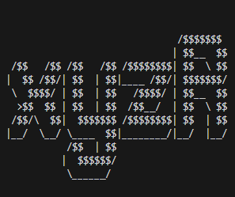

# xyzRec - Reconnaissance Tools

Collectively gather your target information with xyzR. By integrating directory tracking, subdomain search, and Google dorking, it enables detailed target mapping.





[](https://github.com/fxfyfaza/xyzR/releases)
[](https://github.com/fxfyfaza/xyzR/issues)
[](https://github.com/fxfyfaza/xyzR)
[](https://github.com/fxfyfaza)
[](https://www.linkedin.com/in/fazafajarr/)

[[LinkedIn](https://www.linkedin.com/in/fazafajarr/)] [[GitHub](https://github.com/fxfyfaza/)] [[Website](https://fazafajarportfolio.vercel.app/)]


## Installation

Install my-project with git-clone

```bash
  git clone https://github.com/fxfyfaza/xyzR
```

Masuk kedalam Directory File RAFT

```bash
  cd xyzR/
```

Jalankan Tools menggunakan command `python3`
```bash
  python3 xyzR.py

```  


## 🔗 Links
[](https://github.com/LazyCats07/)
[](https://www.linkedin.com/in/mrafiediananta/)


## Authors

- [@fxfyfaza](https://github.com/fxfyfaza/)