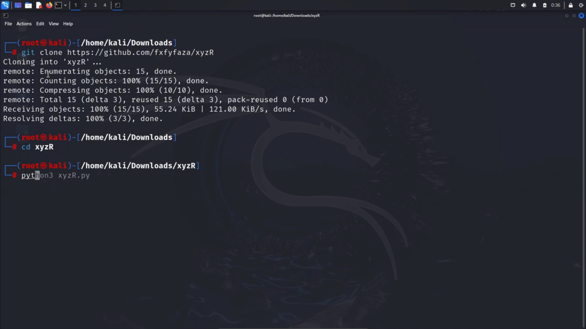

# xyzRec - Reconnaissance Tools

Collectively gather your target information with xyzR. By integrating directory tracking, subdomain search, and Google dorking, it enables detailed target mapping.


[](https://github.com/fxfyfaza/xyzR/issues)
[](https://github.com/fxfyfaza/xyzR)
[](https://github.com/fxfyfaza)
[](https://www.linkedin.com/in/fazafajarr/)

[[LinkedIn](https://www.linkedin.com/in/fazafajarr/)] [[GitHub](https://github.com/fxfyfaza/)] [[Website](https://fazafajarportfolio.vercel.app/)]


## Installation

Install my-project with git-clone

```bash
  git clone https://github.com/fxfyfaza/xyzR
```

Masuk kedalam Directory File xyzR

```bash
  cd xyzR/
```

Jalankan Tools menggunakan command `python3`
```bash
  python3 xyzR.py

```  
## Usage

[](https://youtu.be/3O8JYASH_rA)

```bash
Click the Demo Above!
```


## 🔗 Links
[](https://github.com/fxfyfaza/)
[](https://www.linkedin.com/in/fazafajarr/)


## Authors

- [@fxfyfaza](https://github.com/fxfyfaza/)

## SPECIAL THANKS TO
- [@yassineaboukir](https://gist.github.com/yassineaboukir) for the [List and API endpoints and objects](https://gist.github.com/yassineaboukir/8e12adefbd505ef704674ad6ad48743d)
- [@rbcscan](https://github.com/rbsec) for the [Subdomains List](https://github.com/rbsec/dnscan)
